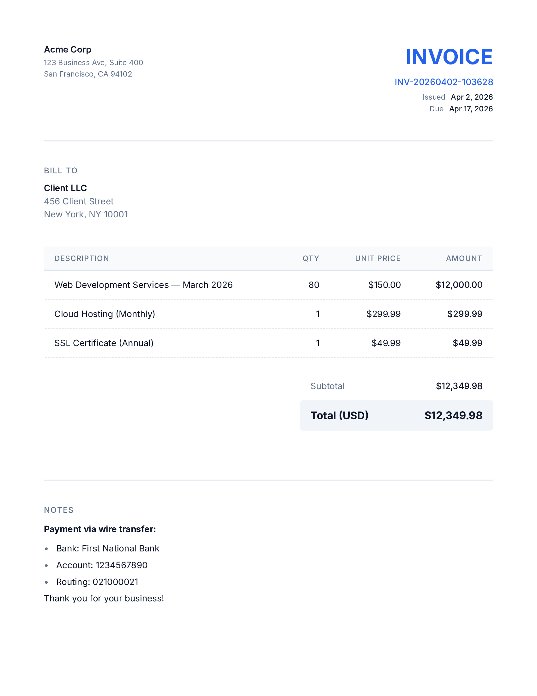

# invoicer

A clean, fast CLI tool that generates professional PDF invoices from simple YAML files. Built with TypeScript and Bun.

<p align="center">
  
</p>

## Quick start

```bash
bun install
bun run src/index.ts invoice.yaml
```

That's it. A timestamped PDF lands in your current directory.

```
  Config     invoice.yaml
  Invoice    INV-20260402-153045
  Issued     Apr 2, 2026
  Due        Apr 17, 2026
  Items      3
  Total      $12,349.98

  ✓ INV-20260402-153045.pdf (23 KB)
```

## Build a standalone binary

```bash
bun run build
```

Produces a self-contained executable at `bin/invoicer` (~62MB) with all dependencies and fonts embedded. No runtime needed — just copy it anywhere.

```bash
./bin/invoicer invoice.yaml
```

## Writing an invoice

Create a YAML file — here's a full example:

```yaml
from:
  name: "Your Company"
  address: |
    123 Business Ave, Suite 400
    San Francisco, CA 94102

bill_to:
  name: "Client Name"
  address: |
    456 Client Street
    New York, NY 10001

items:
  - description: "Web Development Services"
    quantity: 80
    unit_price: 150.00
  - description: "Cloud Hosting (Monthly)"
    quantity: 1
    unit_price: 299.99
  - description: "SSL Certificate (Annual)"
    quantity: 1
    unit_price: 49.99

due_days: 15

notes: |
  **Payment via wire transfer:**
  - Bank: First National Bank
  - Account: 1234567890
  - Routing: 021000021

  Thank you for your business!
```

### Fields reference

| Field | Required | Description |
|-------|----------|-------------|
| `from.name` | yes | Sender / company name |
| `from.address` | yes | Sender address (multiline) |
| `bill_to.name` | yes | Recipient name |
| `bill_to.address` | yes | Recipient address (multiline) |
| `items[].description` | yes | Line item description |
| `items[].quantity` | yes | Quantity (positive number) |
| `items[].unit_price` | yes | Unit price in USD |
| `due_days` | yes | Payment due in N days from issue date |
| `notes` | no | Free text — supports **bold**, *italic*, and bullet lists via Markdown |

The invoice ID and output filename are generated automatically from the current timestamp (`INV-YYYYMMDD-HHMMSS.pdf`).

## CLI options

```
invoicer <config.yaml>
invoicer generate <config.yaml>
```

| Flag | Description |
|------|-------------|
| `-o, --output <dir>` | Output directory (default: current directory) |
| `-h, --help` | Show help |
| `-v, --version` | Show version |
